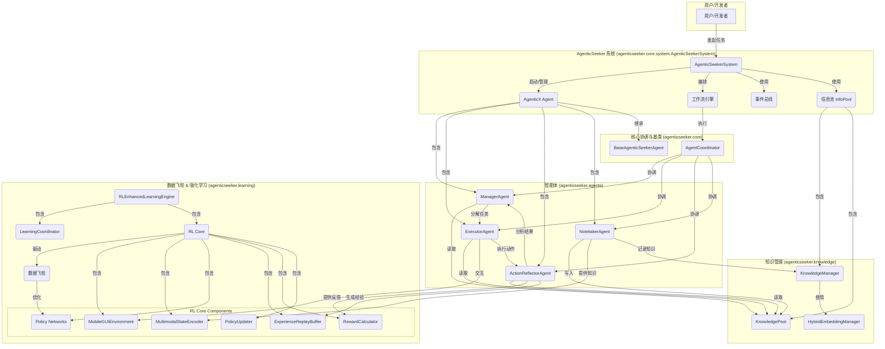

# AgenticSeeker: 基于 AgenticX 的自主移动GUI智能体系统

AgenticSeeker 是一个先进的多智能体系统，构建于 `agenticx` (v0.2.1) 框架之上。它旨在通过自然语言指令，实现对Android设备GUI的复杂操作自动化。系统集成了强大的多模态能力、知识管理和强化学习机制，使其能够持续学习并优化其行为。


## 核心特性

*   **多智能体协作**: 由指挥官、执行者、反思者、记录员等多个智能体协同工作，完成复杂任务。
*   **知识驱动**: 内置知识池，能够沉淀和复用操作经验，提高任务成功率。
*   **强化学习**: 创新的数据飞轮机制，通过与环境的持续交互进行自我进化和策略优化。
*   **多模态理解**: 能够理解屏幕截图、UI布局等多模态信息，做出精准决策。
*   **高度可扩展**: 基于 AgenticX 框架，易于扩展新的智能体、工具和能力。

## 技术架构

系统采用分层、模块化的设计，核心组件包括：



## 环境准备

在开始之前，请确保您的系统已安装以下软件：

1.  **Conda**: 用于管理Python环境。
    *   [Miniconda 安装指南](https://docs.conda.io/en/latest/miniconda.html)
2.  **Android SDK Platform Tools (ADB)**: 用于连接和控制Android设备。
    *   **macOS**: `brew install android-platform-tools`
    *   **Ubuntu**: `sudo apt install android-tools-adb`
3.  **Python 3.9+**

## 安装与配置

我们提供了一键式安装脚本来简化环境搭建过程。

### 1. 自动安装 (推荐)

直接运行项目根目录下的 `setup.sh` 脚本即可自动完成所有环境准备、依赖安装和配置工作。

```bash
bash setup.sh
```

该脚本会执行以下操作：
*   检查 Conda, ADB, Python 环境。
*   创建名为 `agenticseeker` 的 Conda 环境。
*   激活环境并安装所有依赖。
*   在开发模式下安装 `agenticx==0.2.1` 框架。
*   从 `.env.example` 创建 `.env` 配置文件。
*   创建 `run.sh` 启动脚本。

### 2. 手动安装

如果您希望手动进行安装，请遵循以下步骤：

#### 第一步：克隆项目并创建环境

```bash
# 假定您已克隆 AgenticX 仓库
# git clone https://github.com/your-repo/AgenticX.git
# cd AgenticX/examples/agenticx-for-ecloudcup/agenticx-for-ecloudcup/agenticseeker

# 创建并激活 Conda 环境
conda create -n agenticseeker python=3.13 -y
conda activate agenticseeker
```

#### 第二步：安装 AgenticX 框架

AgenticSeeker 依赖于 `agenticx` 框架。您需要以**可编辑模式 (editable mode)** 安装它。脚本会自动找到仓库根目录进行安装。

```bash
# 进入 AgenticX 仓库的根目录
# cd /path/to/your/AgenticX/
# pip install -e .
# 确认版本为 0.2.1 或兼容版本
pip show agenticx
```

#### 第三步：安装项目依赖

```bash
# 回到 agenticseeker 目录
# cd examples/agenticx-for-ecloudcup/agenticx-for-ecloudcup/agenticseeker

# 更新 pip 并安装依赖
pip install --upgrade pip
pip install -r requirements.txt
```

#### 第四步：配置环境变量

复制环境变量模板文件，并根据您的实际情况填写 `LLM_PROVIDER` 和对应的 `API_KEY`。

```bash
cp .env.example .env
nano .env  # 或者使用您喜欢的编辑器
```

`.env` 文件内容示例:
```
# LLM 配置
LLM_PROVIDER="openai" # 支持 "openai", "deepseek", "kimi" 等
OPENAI_API_KEY="sk-..."
DEEPSEEK_API_KEY="sk-..."
KIMI_API_KEY="..."
# ... 其他配置
```

## 运行系统

### 1. 连接设备

确保您的Android设备已通过USB连接，并已开启“开发者选项”和“USB调试”功能。通过以下命令验证设备是否成功连接：

```bash
adb devices
```
您应该能看到类似 `List of devices attached` 和您的设备ID。

### 2. 启动 AgenticSeeker

使用 `run.sh` 脚本来启动系统。

*   **交互模式**: 在此模式下，您可以与系统进行多轮对话，动态下达指令。
    ```bash
    ./run.sh --interactive
    ```

*   **单任务模式**: 直接指定一个任务，系统执行完毕后会自动退出。
    ```bash
    ./run.sh --task "在设置中将语言切换为英文"
    ```

## Docker 部署

对于需要容器化部署的场景，我们提供了完整的 Docker 和 Docker Compose 配置。

1.  **进入 `docker` 目录**:
    ```bash
    cd docker
    ```

2.  **配置环境变量**:
    复制并编辑 `env.example` 文件为 `.env`，填入数据库、API密钥等信息。
    ```bash
    cp env.example .env
    nano .env
    ```

3.  **启动服务**:
    使用 Docker Compose 一键启动所有服务，包括 AgenticSeeker 应用、PostgreSQL 数据库、Redis 缓存等。
    ```bash
    docker-compose up --build
    ```

更多详细信息，请参考 `docker/README.md`。

## 开发与测试

项目内置了丰富的测试用例，以确保代码质量和系统稳定性。

*   **运行测试**:
    ```bash
    # 确保已安装 pytest 相关依赖
    pytest
    ```

*   **代码规范**:
    项目使用 `black`, `isort`, `flake8` 进行代码格式化和静态检查。建议在提交代码前运行 `pre-commit`。
    ```bash
    pre-commit install
    pre-commit run --all-files
    ```